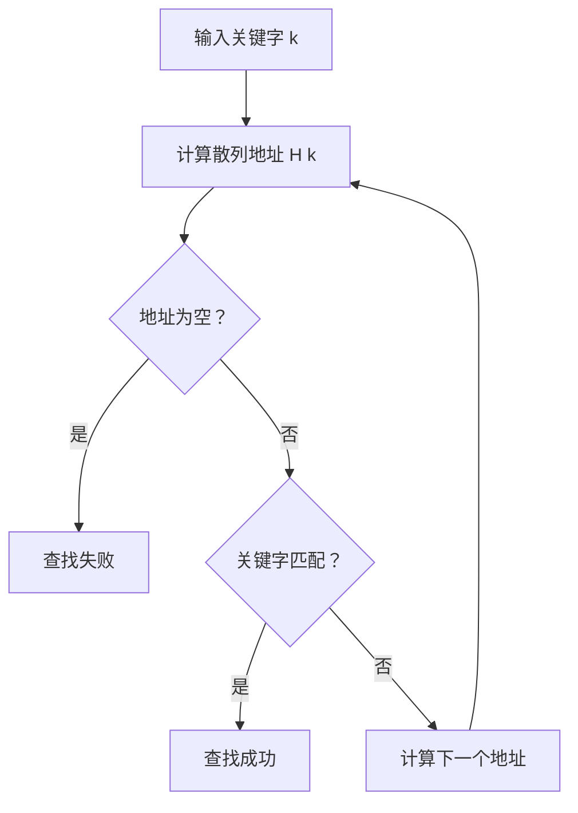

本节我们来学习几种经典的查找算法
# 一、查找相关概念
“查找”的基本概念在数据结构中是一个重要的内容，指的是**在一组数据中根据给定的“关键字”找出与之相对应的记录**。查找操作广泛应用于各种实际问题，如数据库检索、操作系统调度等

**查找的定义**
查找是指：在包含多个数据元素的集合中，按照某种查找方法确定与给定值（即关键字）相等的数据元素位置的过程若找到，返回该元素的位置或内容；若未找到，返回失败标志

**查找的基本要素**
1. 查找表：存放数据元素的集合，可能是数组、链表、树等结构
2. 关键字：用于标识数据元素的值，是查找的依据。
3. 查找操作：
    - 成功查找：找到与关键字匹配的元素
    - 失败查找：查找过程中没有找到匹配的元素
        
**查找算法的分类**
查找算法可以根据查找过程是否依赖数据的结构和顺序，分为：

| 类型   | 说明               |
| ---- | ---------------- |
| 静态查找 | 查找过程中数据集合不发生变化   |
| 动态查找 | 查找过程中数据集合允许插入或删除 |

**常见的查找方式**
根据实现方式常见的查找方法包括：

1. **顺序查找**（线性查找）：逐个比较，适用于无序结构
2. **二分查找**（折半查找）：适用于**有序数组**
3. **分块查找**：将数据分块，每块内使用顺序查找，块间用索引
4. **哈希查找**（散列查找）：通过函数直接定位，效率高
5. **树表查找**：
    - 二叉排序树查找   
    - 平衡二叉树（AVL）   
    - B树/B+树（用于文件系统和数据库）    

**查找的性能衡量指标**
我们使用**查找时的平均查找长度**（ASL）来进行性能衡量和判断
其计算公式为：
$$ASL=\sum_{i=1}^{n}p_ic_i$$
其中：
- n：记录的数据个数
- pi：查找到第i个记录的个数（通常认为为1/n）
- ci：查找到第i个记录所需要的比较次数
    
**查找的常见操作**
1. 查询某个“特定的”数据元素是否在查找表中;
2. 检索某个“特定的”数据元素的各种属性,
3. 在查找表中插入一个数据元素;
4. 删除查找表中的某个数据元素

    

# 二、基于线性表的查找算法
基于线性表存储结构实现的查找算法主要有三种：
- 顺序查找
- 折半查找
- 分块查找

我们来分别介绍这三个算法
## 1.线性查找表的存储结构
**存储结构定义**
对于任意一个存储数据，我们都可以这样表示：
```C
typedef struct{
	KeyType key;      //关键字域
	.............               //其他域，例如名称、数据值等
}ElemType;
```
我们根据定义，就能使用一个线性表来构造一个查找表：
```C
typedef struct{
	ElemType *R;
	int length;
}SSTable;
```
## 2.顺序查找

**适用范围**
- 查找表为**静态查找表**（查找过程中不发生插入或删除）；
- 存储结构可为**顺序表**或**线性链表**； 
- **表中元素无序**，不适合使用二分查找等需有序结构的方法

**代码实现**
正向表示：
```C
int Search_Seq(SSTable ST,KeyType key){
	//从查找表最后依次向前对比，若查找到就返回位置；若未查找到就返回0
	for(int i = ST.length ; i >= 1;--i){
		if(ST.R[i].key == key){
			return i;
		}
	}
	return 0;
}
```
反向表示：
```C
int Search_Seq(SSTable ST,KeyType key){
	for(int i = ST.length;ST.R[i] != key && i > 0;--i);
	if(i > 0) return i;
	else return 0;
}
```

我们也可以将**关键字Key存入表头**（称为哨兵），从后往前逐个比较，直到查找到关键字，返回所在位置；若表中不存在关键字，就返回表头位置，也就是0；
这样做可以**省略每次都要检测是否查找完成的步骤**，加快查找速度
![[Pasted image 20250607201203.png]]
**代码实现**
```C
int Search_Seq(SSTable ST,KeyType key){
	ST.R[0] key = key;
	for(int i = ST.length;ST.R[i].key != key;--i);
	return i;
}
```

**效率分析**
对于任意一个查找元素，与数值无关而与位置有关：
- 查找第i个元素，需要比较n-i+1次
- 查找失败，则需要比较n+1次

我们假设每个元素查找成功的概率时相同的，为1/n；则
$$ASL = ({1/n})\sum_{i=1}^{n}(n-i+1)$$
计算结果为$ASL=(n+1)/2$，**时间复杂度为：$O(n)$**

由于需要一个辅助空间来存储关键字，所以**空间复杂度为:**$O(1)$

*与顺序查找相关的几个问题*

*1.记录的查找概率不相等时如何提高查找效率?*
查找表存储记录原则——按查找概率高低存储:
1. 查找概率越高，比较次数越少
2. 查找概率越低，比较次数较多

*2.记录的查找概率无法测定时如何提高查找效率?*
按查找概率动态调整记录顺序:
1. 在每个记录中设一个访问频度域
2. 始终保持记录按非递增有序的次序排列
3. 每次查找后均将刚查到的记录直接移至表头

**优缺点分析**
- 优点：算法简单；逻辑次序无要求，且适用于不同的存储结构
- 缺点：时间效率低

## 3.折半查找
前面提到，顺序查找由于查找表中的元素是无序的，所以每次查找时都只能一个一个遍历；为了提高效率，我们给查找表中的**元素进行排序**，每次就能缩小查找区间，提高时间效率

**算法思路**
![[Pasted image 20260116234532.png|500]]
- 我们将查找表中两端点命名为$low$端和$high$端，取中间位置$mid=(low+high)/2$
- 将关键字的大小和中间位置的数值进行比较，更新中间位置：
	- 若key < mid，则 high = mid - 1;
	- 若key > mid，则 low = mid + 1;
	- key == mid，则直接找到
- 反复执行以上操作，直到low>hig时，算法失效，查找失败

**代码实现**
使用循环实现：
```C
int Search_Bin(SSTable ST,KeyType key){
	int low = 1;
	int high = ST.length;
	while(low <= high){
		mid = (low + high) / 2;
		if(ST.R[mid].key == key){
			return mid;
		}else if(key < ST.R[mid].key){
			high = mid - 1;
		}else
			low = mid + 1;
	}
	return 0;
}//Search_Bin
```
使用递归实现：
```C
int Search_Bin(SSTable ST, keyType key, int low, int high){
	if(low>high) return 0;//查找不到时返回0
	mid=(low+high)/2;
	if(key == ST.elem[mid].key){
		return mid;
	}
	else if(key < STelem[mid].key){
		//递归,在前半区间进行查找
		Search_Bin(SSTable ST,KeyType key,int low,int mid);
	}
	else if(key < STelem[mid].key){
		//递归,在后半区间进行查找
		Search_Bin(SSTable ST,KeyType key,int mid,int high);
	}
}
```

**效率分析**
对于折半查找，我们每次寻找的过程都相当于进行一次判断，我们用树表示这个判断过程——称为判断树
![[Pasted image 20260116234541.png|500]]
对于这样一个查找表，我们根据折半查找，可以得到这样一个判断树：
![[Pasted image 20250609153701.png|500]]
- 树中每个结点中记录着查找表中的元素位置
- 每次查找，我们都需要一次比较，**比较次数等于路径上的结点数、等于结点的层数**
- 所以我们可以得到，**比较次数小于等于树的深度，即$\lfloor log_2n\rfloor+1$**

>在这里，$\lfloor x\rfloor$是指对其向下取整的意思

**平均查找长度的计算**
设查找表长n=$2^h$-1，则h=$log_2(n+1)$（则判定树的深度为h），且表中每个记录查找的概率相等$p_i = 1/n$
则平均查找长度为：
$$\begin{align*}
ASL_{bs} &= \sum_{i=1}^{n} p_i c_i = \frac{1}{n} \sum_{i=1}^{n} c_i = \frac{1}{n} \sum_{j=1}^{h} j \cdot 2^{j-1} \\
&= \frac{n+1}{n} \log_2(n+1) - 1 \\
&\approx \log_2(n+1) - 1 \quad (n > 50)
\end{align*}
$$
在这里：j表示第j层每个结点要比较的次数，$2^{j-1}$则表示每层的结点数

**优缺点分析**
- 优点：效率比顺序查找高
- 缺点：只适用于有序表；且存储结构仅限于顺序存储结构，无法用于链式表

## 4.分块查询
分块查询（也称分块查找或索引顺序查找）是一种结合了顺序查找和折半查找优点的查找算法
其核心思想是**将一个大的数据表划分为若干个块（子表）**，**每个块内的数据可以无序存放，但块与块之间必须满足有序关系**

**算法思路**
- **分块有序**：将数据表分成若干块，块内元素无序，但块间有序；具体要求是每个块的最大关键字小于后续块中任一元素的关键字
- **索引表建立**：为每个块建立索引项，索引项包含该块的最大关键字和该块第一个元素的位置，索引表按关键字有序排列
- **查找过程**：
    1. 在索引表中通过顺序查找或折半查找确定目标关键字所在的块 
    2. 在确定的块内查找具体元素采用顺序查找找到具体元素
![[Pasted image 20260116235632.png]]

**效率分析**
设查找表长度为n，均匀分成b块，每块包含s个元素，则有：n=b×s
查找时先在索引表中定位块，再在块内顺序查找。

**索引表采用顺序查找**
索引表长度为 b，顺序查找的平均查找长度为：
$$L_b=\frac{b+1}{2}$$
块内顺序查找的平均查找长度为：

$$L_w=\frac{s+1}2$$

因此，分块查找的总平均查找长度为：
$$ASL=L_b+L_w=\frac{b+1}2+\frac{s+1}2$$

**索引表采用折半查找**
索引表查找平均长度约为：
$$Lb=log⁡_2(b+1)$$
块内顺序查找平均长度同上：
$$L_w=\frac{s+1}2$$

总平均查找长度为：
$$ASL=L_b+L_w=log⁡_2(b+1)+\frac{s+1}2$$

**优缺点分析**
- 优点：插入和删除容易，无需大量移动
- 缺点：要增加一个索引表的存储空间并对初始索引表进行排序运算
- 使用情况：如果线性表既要快速查找，又要经常变更，则可以采用分块查找

## 5.三种查找方式比较
| 特性     | 顺序查找                   | 折半查找（二分查找）        | 分块查找（索引顺序查找）                              |
| ------ | ---------------------- | ----------------- | ----------------------------------------- |
| 查找原理   | 从头到尾逐个元素比较，直到找到目标或遍历结束 | 在有序表中通过不断折半缩小查找区间 | 先在索引表（块最大值有序）中定位块，再块内顺序查找                 |
| 适用条件   | 无需数据有序，适用于任意存储结构       | 要求数据顺序存储且关键字有序    | 要求索引表有序，块内数据无序，适合动态变化数据                   |
| 时间复杂度  | 最坏O(n)，平均O(n)          | 最坏和平均O(log n)     | 索引查找O(log b)或O(b)，块内顺序查找O(s)，n=b×s        |
| 平均查找长度 | 约 (n+1)/2              | 约 log₂(n+1)       | 索引查找长度 + 块内查找长度：$log⁡_2(b+1)+\frac{s+1}2$ |
| 存储结构   | 顺序表或链表均可               | 仅顺序存储结构           | 顺序表或链表均可，需额外索引表存储空间                       |
| 优点     | 简单，无需排序，插入删除方便         | 查找效率高，适合静态有序数据    | 兼顾查找效率和动态数据插入删除灵活性                        |
| 缺点     | 查找效率低，数据量大时性能差         | 要求数据有序，插入删除代价高    | 需维护索引表，索引表排序和块划分有一定开销                     |

# 三、基于树结构查找表的查找算法

在前面，我们学习了顺序表的折半查找；有序表在插入、删除操作时，为了维护表的有序性，我们需要移动表中很多记录
为了维护折半查找的优良性能，又为了提升表的可维护性，我们改用了定态的查找表——几种**特殊树结构**，使**表结构在查找过程中动态生成**
树结构的查找表主要有以下几种：
- 二叉排序树
- 平衡二叉树
- 红黑树
- B-树
- B+树
- 键树
本节我们主要介绍前两种
## 1.二叉排序树
二叉排序树（Binary Sort Tree，BST），又称二叉查找树或二叉有序树
二叉排序树的特点是，其结构通常不是一次生成的，而是**在查找过程中，当树中不存在关键字等于给定值的结点时再进行插入**

**二叉排序树的定义与性质**
二叉排序树或者是一棵空树，或者是具有以下性质的二叉树:
1. 若左子树不为空，则左子树上所有节点的值均小于根节点的值
2. 若右子树不为空，则右子树上所有节点的值均大于根节点的值
3. 左右子树也分别为二叉排序树

**二叉树存储结构定义**
存储数据定义：
```C
typedef struct{
	KeyType key;     //关键字域
	InfoType info;  //其他数据域
}ElemType;
```
二叉树结构定义：
```C
typedef struct BSTNode{
	ElemType data;
	struct BSTNode *lchild,*rchild;
}BSTNode,*BSTree;
```

**二叉排序树的中序遍历**
- 中序遍历的顺序是：先访问左子树，再访问根节点，最后访问右子树（左-中-右）
- 由于左子树的所有节点值都小于根节点，右子树的所有节点值都大于根节点，递归地对左右子树进行中序遍历，**最终访问的节点值是从小到大排列的，即有序序列** 
## 2.基于二叉排序树的算法
### 2.1二叉排序树的查找
**算法思路**
- 若查找的关键字等于根节点，则查找成功
- 否则：
	- 若小于根节点，查找其左子树
	- 若大于根节点，查找其右子树
- 在左右子树上递归查找操作

**代码实现**
```C
// 查找节点 
Node* searchNode(Node* root, int key) { 
	if (root == NULL || root->data == key)
		 return root;
	if (key < root->data) 
		return searchNode(root->left, key);
	else return 
		searchNode(root->right, key); 
}
```

**效率分析**
二叉排序树的**平均查找长度与树的形态密切相关**

最好情况：树形均衡
- **初始序列**：{45, 24, 53, 12, 37, 93}
- **树的形态**：接近完全平衡二叉树
- **平均查找长度（ASL）**：$ASL=log⁡_2(n+1)−1$
- **树的深度**：$log⁡_2n+1$
- **查找效率**：与折半查找的判定树相同，时间复杂度为$O(log⁡_2n)$
- **特点**：节点分布均匀，查找效率高  

最坏情况：树形退化为单支
- **初始序列**：{12, 24, 37, 45, 53, 93}
- **树的形态**：每个新元素都比前一个大，插入后形成单链表状的“斜树”
- **平均查找长度（ASL）**：$ASL=\frac{n+1}2$
- **树的深度**：n
- **查找效率**：与顺序查找类似，时间复杂度为 $O(n)$
- **特点**：节点极度不平衡，查找效率低

**效率优化**
为了使二叉排序树的平均查找长度尽量小，为了避免极端情况，我们需要**使二叉树形状尽可能地平衡**，也就是**平衡二叉树**
### 2.2二叉排序树的插入
**算法思路**
1. 从根节点开始比较：将待插入的关键字与当前节点关键字比较
2. 判断插入方向 
    - 如果待插入关键字小于当前节点关键字，转向左子树   
    - 如果大于当前节点关键字，转向右子树 
3. 递归查找插入位置：重复步骤2，直到找到一个空的子树位置（即左子树或右子树为空）
4. 插入新节点：在空位置创建新节点，将其作为叶子节点插入
5. 若关键字已存在：通常不插入重复关键字，直接返回

**代码实现**
```C
struct node* insert(struct node* root, int key) {
    if (root == NULL) {
        // 树为空，创建新节点作为根节点
        return newNode(key);
    }
    if (key < root->key) {
        // 插入左子树
        root->left = insert(root->left, key);
    } else if (key > root->key) {
        // 插入右子树
        root->right = insert(root->right, key);
    } else {
        // 关键字已存在，不插入
        return root;
    }
    return root;
}
```
### 2.3二叉排序树的生成
- 从空树出发，经过一系列的查找、插入操作之后，可以生成一棵二叉排序树；一个无序序列可通过构造二叉排序树变成一个有序序列，**构造树的过程就是对无序序列进行排序的过程**
- 插入的结点均为叶子结点，故无需移动其他结点
- 对于相同的无序序列，**输入顺序不同，生成的二叉排序树的结构也不同** 
![[Pasted image 20260117000250.png]]
### 2.4二叉排序树的删除
- 从二又排序树中删除一个结点，不能把以该结点为根的子树删去，只能删掉该结点，并且**还应保证删除后所得的二又树仍然满足二叉排序树的性质不变**
- 由于中序遍历二叉排序树可以得到一个递增有序的序列；那么，**在二叉排序树中删去一个结点相当于去有序序列中的一个结点**
- 此外我们还要保证：
	- 将因删除结点而断开的二叉链表重新链接起来
	- 防止重新链接后树的高度增加

**算法思路：**
根据删除节点的种类，分为以下几种情况：
1. 删除的是叶子节点  
    直接删除该节点，释放内存，更新父节点指针为NULL，不影响树的其他结构。
2. 删除的节点只有一个子树（左子树或右子树）  
    用该节点的唯一子树替代该节点的位置，调整父节点指针指向该子树，释放被删除节点的内存
3. 删除的节点有两个子树(左子树和右子树均不为空):需要找到该节点的“替代节点”，通常有两种选择：
    - **左子树中的值最大节点**
    - **右子树中的值最小节点**

用替代节点的值覆盖待删除节点的值，然后递归删除替代节点（该替代节点必定是叶子节点或只有一个子树，归于前两种情况处理）

**代码实现**
```C
struct node* deleteNode(struct node* root, int key) {
    if (root == NULL) return root;

    if (key < root->key) {
        root->left = deleteNode(root->left, key);
    } else if (key > root->key) {
        root->right = deleteNode(root->right, key);
    } else {
        // 找到待删除节点
        if (root->left == NULL) {
            struct node* temp = root->right;
            free(root);
            return temp;
        } else if (root->right == NULL) {
            struct node* temp = root->left;
            free(root);
            return temp;
        } else {
            // 左右子树均不空，找到右子树最小节点（后继）
            struct node* temp = findMin(root->right);
            root->key = temp->key;
            root->right = deleteNode(root->right, temp->key);
        }
    }
    return root;
}

struct node* findMin(struct node* root) {
    while (root->left != NULL)
        root = root->left;
    return root;
}
```

## 2.平衡二叉树
我们之前讨论过，要是二叉排序树的平均查找长度尽可能地小，就需要使二叉排序树尽可能地平衡，也就是平衡二叉树（Balanced Binary Tree），下面我们来介绍平衡二叉树

**平衡二叉树的性质**
- **定义**：  
    平衡二叉树是一棵空树，或者它的左右**两个子树的高度差的绝对值不超过1**，且左右两个子树本身也是平衡二叉树
- **平衡因子（Balance Factor，BF）**：  
    对于任意节点，**平衡因子定义为其左子树高度减去右子树高度**；平衡二叉树要求每个节点的平衡因子只能是 −1,0,1
- **递归性质**：  
    平衡二叉树继承了二叉搜索树的性质，即左子树所有节点值小于根节点，右子树所有节点值大于根节点
- 对于有n结点的AVL树，其高度保持在$O(log_2n)$数量级，ASL也保持在$O(log_2n)$的数量级
## 3.平衡二叉树的调整
我们要强调的是，**二叉树在失衡条件下仍然能保持其序列的正确性**，调整的操作也要在这个基础上进行
旋转是恢复平衡的主要手段，通过调整节点间的连接关系来**改变树的局部结构，降低树的高度同时保持序列**，主要有四种基本旋转方式:

- **右旋（LL旋转）** 当失衡节点是由于在其左子节点的左子树中插入新节点而导致时使用；将失衡节点的左子节点提升为新的根节点，并将原根节点变为其右子节点.
    **形象记忆**：右旋就是当前节点“往右下方推”，它的左孩子“顶上来”做根

![[Pasted image 20250609202758.png|400]]
- **左旋（RR旋转）** 与右旋相反，当失衡节点是由于在其右子节点的右子树中插入新节点而导致时使用；将失衡节点的右子节点提升为新的根节点，并将原根节点变为其左子节点.
    **形象记忆**：左旋就是把当前节点“往左下方推”，它的右孩子“顶上来”做根
![[Pasted image 20250609203517.png|400]]
- **左右旋（LR旋转）** 当失衡节点是由于在其左子节点的右子树中插入新节点而导致时使用；首先对失衡节点的左子节点进行左旋，然后对失衡节点本身进行右旋.
![[Pasted image 20250609202849.png|400]]
- **右左旋（RL旋转）** 当失衡节点是由于在其右子节点的左子树中插入新节点而导致时使用；首先对失衡节点的右子节点进行右旋，然后对失衡节点本身进行左旋
![[Pasted image 20250609203607.png|400]]
**举例**
*给定关键字序列：(16, 3, 7, 11, 9, 26, 18, 14, 15)，要求给出构建AVL树的步骤*

*构建过程*：
1. 插入16
	- 树为空，16为根节点
![[Pasted image 20260102185852.png|83]]
2. 插入3
	- 3 < 16，插入为16的左孩子   
![[Pasted image 20260102185945.png|125]]
3. 插入7
	- 7 < 16，进入左子树；7 > 3，插入为3的右孩子。
	- 检查平衡因子：16的左子树高度为2，右子树为0，平衡因子为2，失衡 
	- **进行左右旋（LR旋转）**：7作为根节点，16作为右子树、3作为左子树
![[Pasted image 20260102190322.png|400]]
4. 插入11
	- 11 < 7，进入左子树；11 > 3，插入为3的右孩子11>7,进入右子树，插入为16的左孩子
	- 检查平衡因子：无失衡
![[Pasted image 20260102190536.png|150]]
5. 插入9
	- 9 > 7，进入右子树；9 < 16，进入左子树；9 < 11，插入为11的左孩子
	- 检查平衡因子：16的左子树高度为2，右子树为0，平衡因子为2，失衡
	- **进行右旋（RR旋转）**：11作为新的根节点，16作为右子树，9作为左子树
![[Pasted image 20260102190820.png|400]]
6. 插入26
	- 26 > 7，进入右子树；
	- 26 > 11，进入右子树；
	- 26 > 16，插入为16的右孩子；
	- 检查平衡因子：7的左子树高度为1，右子树高度为3，平衡因子为-2，失衡；
	- **进行左旋（LL旋转）**：11作为新的根节点，7为左子树，16为右子树，9加入左子树
  ![[Pasted image 20260102191554.png|475]] 
7. 插入18
	- 18 > 11，进入右子树；18 > 16，进入右子树；18 < 26，插入为26的左孩子；
	- 检查平衡因子：节点16左子树为空，右子树高度为2，平衡因子为-2，失衡；
	- **进行右左旋（RL旋转）**：18上升为根节点，16作为左子树、26作为右子树
![[Pasted image 20260102191939.png|575]]
8. 插入14
	- 14 > 11，进入右子树；14 < 18，进入左子树；14 < 16，插入为16的左孩子；
	- 检查平衡因子：节点16左子树高度为1，右子树为空，平衡因子为+1，平衡；节点18左子树高度为2，右子树高度为1，平衡因子为+1，平衡；
	- 整体平衡，无需旋转
 ![[Pasted image 20260102192239.png|325]]
9. 插入15
	- 15 > 11，进入右子树；15 < 18，进入左子树；15 < 16，进入左子树；15 > 14，插入为14的右孩子；
	- 检查平衡因子：节点14左子树为空，右子树高度为1，平衡因子为-1，平衡；节点16左子树高度为2（14为根），右子树为空，平衡因子为+2，失衡；
	- **进行左右旋（LR旋转）**：15为子树根节点,14为左子树，16为右子树
![[Pasted image 20260102192434.png|600]]

**构建思路**
1. 当有多个结点失衡时，我们**优先调整最小的子树**
2. 在实际操作时，不必死板记忆操作过程，结合实际数值操作更便于理解


# 三、基于散列表的查询算法

散列表（**哈希表**）是一种基于散列函数（**哈希函数**）实现的高效数据结构，能够**通过关键字快速定位对应的存储位置，从而实现快速查找**；散列表查找的核心是利用散列函数将关键字映射到散列表的一个索引位置，然后根据该位置判断是否找到目标元素
## 1.散列表相关概念

- 散列方法(杂凑法)
	选取转换函数，依该函数按关键字计算元素的存储位置并按此存放;
	查找时，由同一个函数对给定值k计算地址，将k与地址单元中元素关键码进行比，确定查找是否成功
- 散列函数(杂凑函数):散列方法中使用的转换函数
$$H(key) = K$$
- 散列表：按照散列方法构造的散列表
- 冲突：不同的关键码映射到同一个散列地址上
$$key1≠key2, \ but \  H(key1)=H(key2)$$

假设有一组关键字序列：{12, 15, 16, 22, 25, 29, 34, 37, 47, 48, 56, 67}

散列表长度为 13，散列函数采用除留余数法：
$$H(key) = key \ mod\ 13$$

>在这里，mod为取模运算，在散列表的构造里经常使用

可以看到，不同的关键字（如12和25，16和29，34和47，15和67）被映射到了相同的散列地址，发生了冲突

- 同义词：具有相同函数值的多个关键字
## 2.散列表的构造
使用散列表要解决两个问题：
1. 构造好的散列函数：
	- 所选函数尽可能简单，以便提高转换速度
	- 所选函数对关键码计算出的地址，散列地址集中均匀分布减少空间浪费
2. 指定一个好的解决冲突的方案：
	- 查找时，如果散列函数计算出的地址中查不到关键码，则应当依据解决冲突的规则，有规律地查询其他相关单元

**构造的要求**
我们根据元素集合的特性来构造：
- 要求一：n个数据源仅占用n个地址，虽然**散列查找是以空间换时间**，但仍希望散列的地址空间尽量小
- 无论用什么方法存储，目的都是尽量**均匀地存放元素**，避免冲突

按照上面的原则，我们制定了如下几个构造方法：

| 构造方法      | 原理                                                                       | 优点                 | 缺点                  | 适用场景                      |
| :-------- | :----------------------------------------------------------------------- | :----------------- | :------------------ | :------------------------ |
| **直接定址法** | 取关键字或其线性函数值为散列地址，如 $\text{Hash}(key) = a \times key + b$                 | 简单、计算方便，不会产生冲突     | 要连续占用地址空间，浪费存储空间    | 关键字范围较小且连续的情况             |
| 数字分析法     | 分析关键字，提取分布均匀的若干位数字拼接为散列地址                                                | 能较好避免冲突，地址分布均匀     | 需预先知道关键字分布，提取位数选择复杂 | 关键字位数较多且分布规律明显的情况         |
| 平方取中法     | 取关键字平方后的中间几位作为散列地址                                                       | 随机性好，冲突概率较低        | 计算相对复杂，特殊关键字可能影响效果  | 关键字范围较广且无明显规律的情况          |
| 折叠法       | 将关键字分割成若干部分，叠加合并后得到散列地址                                                  | 简单易行，充分利用关键字的每一位信息 | 分割方式不合理可能导致地址分布不均匀  | 关键字位数较多且无明显规律的情况          |
| **除留余数法** | 取关键字对某个数（通常是质数）取模的结果作为散列地址，如 $\text{Hash}(key) = key \mod p$(p<=m,且p为质数) | 散列地址分布均匀，冲突概率低     | 若模数选择不当，冲突概率会增加     | 关键字范围较大且无明显规律的情况，模数通常选择质数 |
| 随机数法      | 选择一个随机函数，以关键字作为种子值，通过随机函数生成散列地址                                          | 散列地址随机性好，冲突概率低     | 随机函数的选择和实现较为复杂      | 对散列地址随机性要求较高的情况           |
## 3.处理冲突的方法
散列函数构造再好，在数据量较大的情况下，也总会出现冲突；我们有两种常见的解决冲突的方法

### 3.1开放地址法
基本思想：有冲突时就去寻找下一个空的散列地址，只要散列表足够大，空的散列地址总能找到，并将数据元素存入
例如，在出留余数法中，我们重新构建构造函数来寻找新的地址，方法有以下几种：
- **线性探测法**  
    探测序列为当前位置向后依次递增一个单位：  
$$fi(key)=(h(key)+i) modm,\ i=0,1,2,…,m−1 $$
    优点：实现简单，空间利用率高，连续存储有利于缓存性能
    缺点：容易产生“初级聚集”，即冲突元素聚集在一起，导致探测次数增加，影响性能  
    适用场景：负载因子较低，插入删除不频繁的情况
    
- **二次探测法**  
    探测序列以平方步长跳跃，减少聚集：  
    $$fi(key)=(h(key)±i^2)  \ mod\ m,\ i=0,1,2,…,m−1$$
    优点：缓解了线性探测的聚集问题。  
    缺点：不能保证探测到所有位置，可能导致“辅助聚集”
    
- **双重散列法（再哈希法）**  
    使用两个不同的散列函数，第二个函数决定探测步长：  
    $$fi(key)=(h1(key)+i×h2(key))  modm $$ 
    优点：减少聚集，探测序列更分散，性能较好  
    缺点：计算复杂度较高，实现较复杂
- **随机探测法**
    当发生冲突时，通过伪随机数生成器生成一个随机序列，以确定下一个探测位置，直到找到空闲位置或找到目标元素
   $$fi(key)=(h(key)+d_i)modm$$
   
   
   
**举例**
关键码集：{47, 29, 11, 16, 92, 22, 8, 3}，散列表长度：m = 11，散列函数：Hash(key) = key mod 11，采用线性探测法完成散列表的构建
*构建过程*：
1. 47、7、11、16、92均是由散列函数得到的没有冲突的散列地址，分别为3、7、0、5、4
2. Hash(29) = 7，散列地址有冲突，需寻找下一个空的散列地址；由$H_1=(Hash(29)+1) \ mod \ 11 =8$，散列地址8为空，因此将29存入
3. 其余数字，如22、8、3同样由$H_1$解决冲突

平均查找长度：ASL=(1+2+1+1+1+4+1+2+2)/9 = 1.67
    
### 3.2链地址法 
链地址法是一种常用且简单的散列冲突解决方法，其核心思想是在散列表的每个槽中维护一个链表（通常是单链表），所有映射到同一散列地址的元素都存放在该链表中
    
构造过程：
- 散列函数计算关键字的散列地址 h(key)
- 散列表中对应地址的槽位存储一个链表的头指针
- 当多个关键字映射到同一地址时，这些关键字对应的元素依次插入该链表
- 查找、插入和删除操作都在链表中进行：
    - 查找时先定位散列地址对应的链表头，再遍历链表寻找目标元素
    - 插入时通常将新元素插入链表头部或尾部
    - 删除时在链表中找到元素并移除

**举例**
有一组关键字为：{19、14、23、1、68、20、84、27、55、11、10、79}，散列函数为Hash(key) = key mod 13
我们根据链地址法就能构造出如下散列表：
![[Pasted image 20260102185250.png|600]]

优点：
- 非同义词不会冲突，无聚集现象
- 链表上结点空间动态申请，更适合表长不确定的情况

## 4.散列表的查找算法

**算法步骤**
散列表的查找算法步骤如下：
1. 计算散列地址：使用散列函数 h(key)将待查找的关键字key转换为散列表中的索引地址该函数通常是将key映射到一个固定范围内的整数
2. 访问散列表对应位置：根据散列地址直接访问散列表中对应的位置。
3. 判断查找结果
    - 如果该位置为空，说明关键字不存在，查找失败   
    - 如果该位置的关键字与查找关键字相同，查找成功，返回该位置的元素
    - 如果该位置的关键字不同，说明发生了冲突，需要根据冲突解决方法继续查找
4. 冲突处理查找
    - **链地址法**：访问该位置的链表，遍历链表查找目标关键字
    - **开放定址法**（如线性探测、二次探测、双重散列）：根据探测序列依次访问其他位置，直到找到关键字或遇到空槽 
5. 返回查找结果：找到关键字则返回对应元素，否则返回查找失败信息



**效率分析**
对于关键字集(19、14、23、1、68、20、84、27、55、11、10、79)，关键字个数n=12
*问*：
- 无序查找ASL?
$$ASL=\frac{12+1}{2}$$
- 有序表折半查找ASL？
$$ASL=log_2(12+1)-1$$
- 散列表查找ASL?
    理论上，如果散列表完全没有冲突时，ASL可以为1，但是一般情况下一定会有冲突，其值不是严格的O(1),也不是O(n)

**散列表的平均查找长度**
对于散列表的ASL，取决于：
- 散列函数
- 处理冲突的方法：开放地址法、链地址法
- 散列表的**填装因子**$\alpha$；其值越大，说明表中记录越多，发生冲突的可能性就越大，查找时比较的次数就越多
    $$\alpha=\frac{表中填入的记录数}{散列表的长度}$$
- 对于不同的探测方法，探测因子也不同：
$$\begin{align*}
\text{ASL}_{\text{拉链法}} &\approx 1 + \frac{\alpha}{2} \\[1.5ex]
\text{ASL}_{\text{线性探测法}} &\approx \frac{1}{2} \left( 1 + \frac{1}{1-\alpha} \right) \\[1.5ex]
\text{ASL}_{\text{随机探测法}} &\approx -\frac{1}{\alpha} \ln(1-\alpha)
\end{align*}
$$

